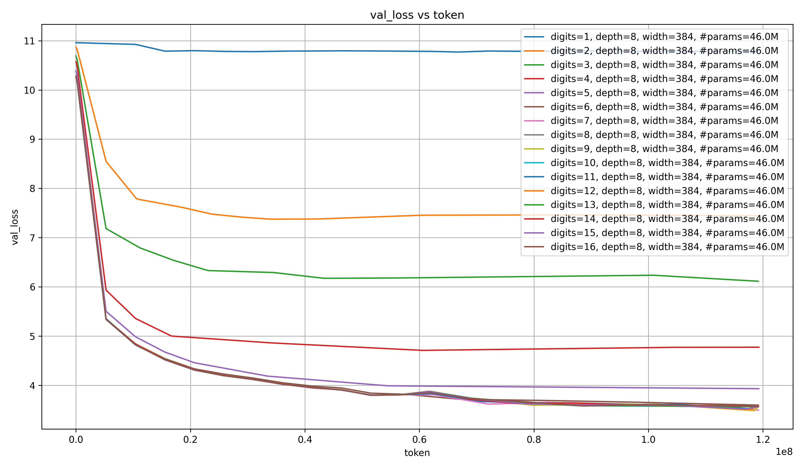
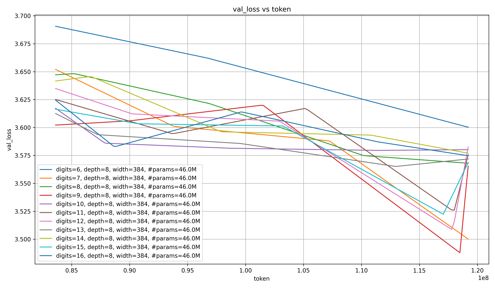
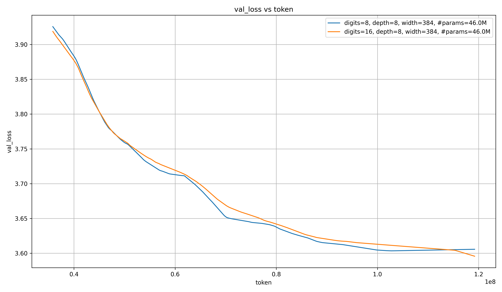
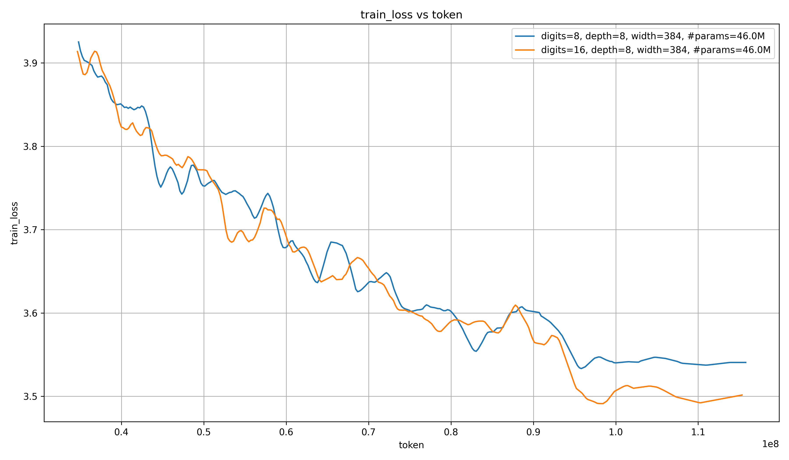
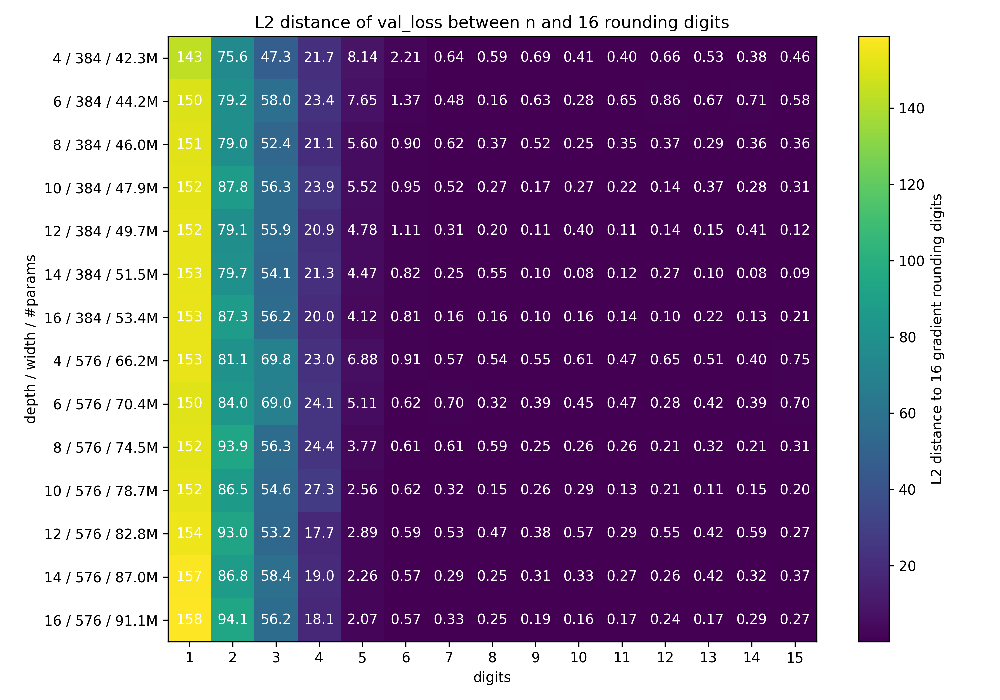
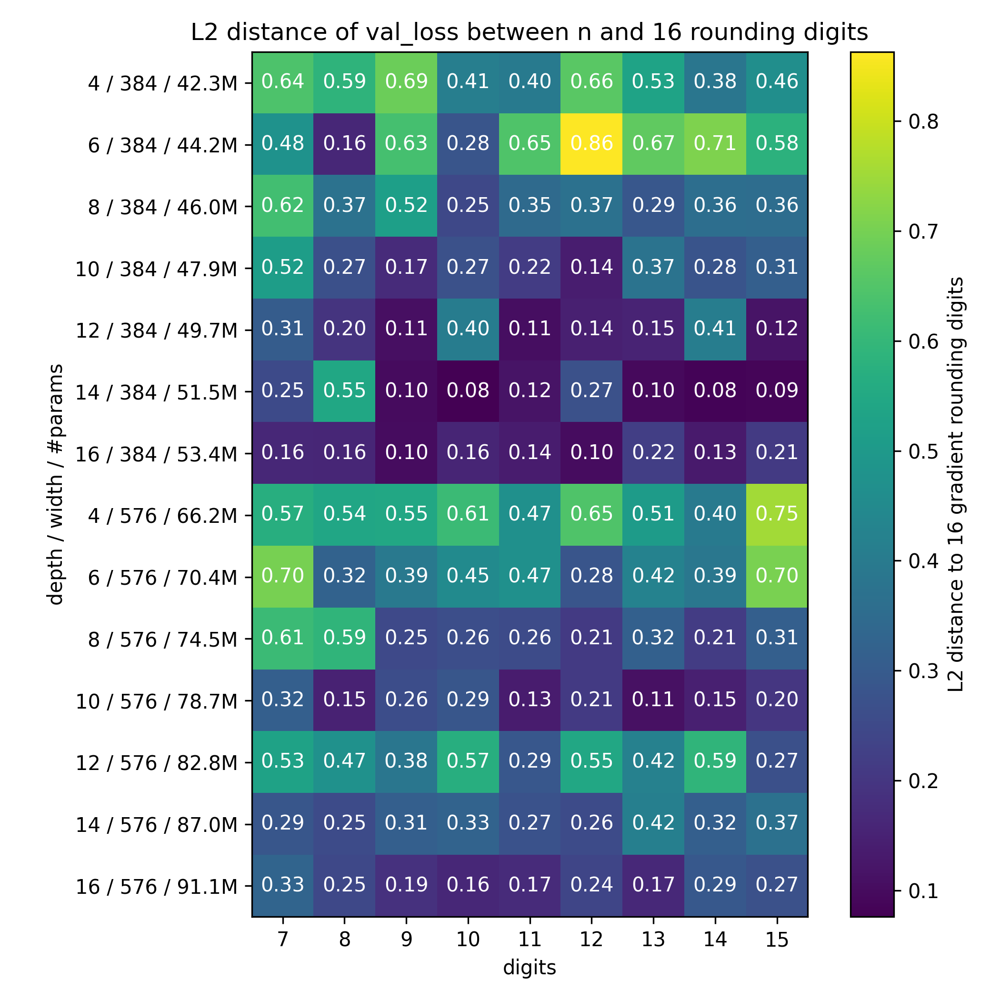
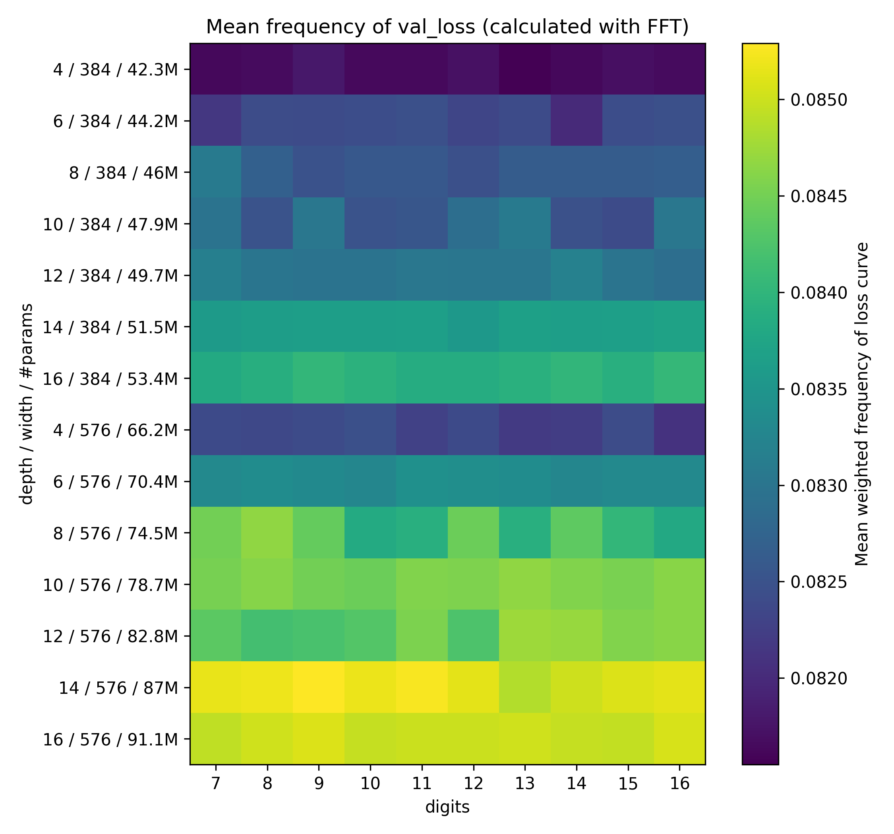
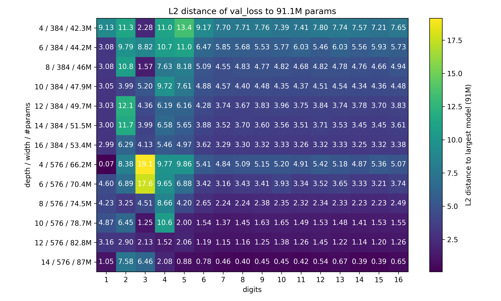
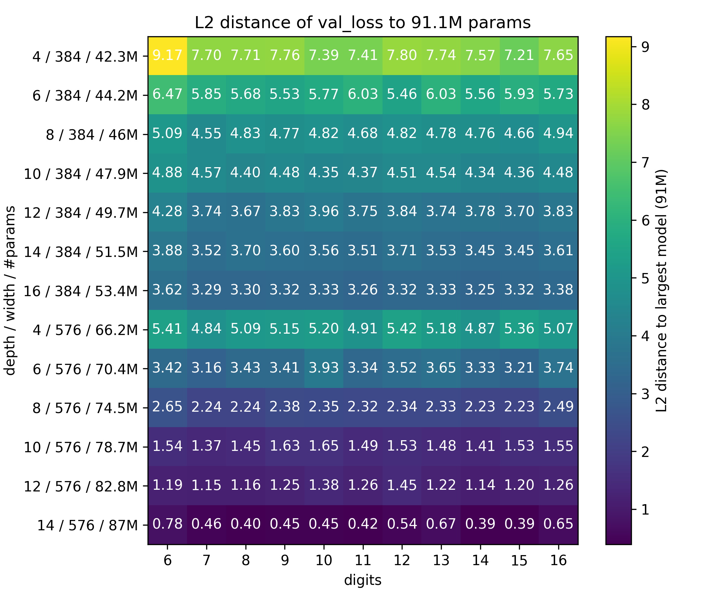

# gradient-rounding

I round the gradient of an LLM to different significant digits during training, and analyze the results.

There is an original motivation for doing this work, and there are the somewhat unrelated results; I will go into both of these.

So here is the table of contents:

- [Original motivation](#original-motivation)
    - [Larger models live in higher-dimensional space](#larger-models-live-in-higher-dimensional-space)
    - [Different behaviors are connected more continuously in high- than in low-dimensional space, making SGD easier](#different-behaviors-are-connected-more-continuously-in-high--than-in-low-dimensional-space-making-sgd-easier)
    - [How would I test this?](#how-would-i-test-this)
- [Results](#results)
- [Summary](#summary)
- [Acknowledgements](#acknowledgements)

## Original motivation

I was curios why larger models learn faster.

You might think that this is not surprising; after all, a smaller model has less model capacity, so obviously it cannot learn as much as a larger one. However, this only explains why the smaller model stops improving after fewer datapoints than the larger model does. It does not explain why even early in training, when there is plenty of model capacity left for learning, the larger model is able to extract more information from the training data than the smaller model.

Put another way:

- You have a large and a small model
- You have a training dataset that is small enough that both models can easily learn the underlying function that generated the data
- But the large model will learn the function after fewer samples than the small model
- The question is: why is that?

Here is my idle speculation (and that's what this is; I didn't really do any research on this, just did the experiments and wrote this down in three days. If you know anything, please let me know @omouamoua on X/Twitter):

> Larger models live in higher-dimensional space. There, different behaviors are connected much more continuously than in lower-dimensional space. This makes it easier for stochastic gradient descent (SGD) to find the best weight configuration, because it is a form of local search.

Let's break this down.

### Larger models live in higher-dimensional space

Any deep neural network can be replaced by a shallow one with only one hidden layer.
The more parameters the original model has, the wider the shallow network, and therefore,
the higher-dimensional its internal representation.

### Different behaviors are connected more continuously in high- than in low-dimensional space, making SGD easier

The core of this argument is that SGD is local search. We want to keep the weights as similar to the previous weights as possible, to avoid unlearning the lessons from the previous step, at every step.

To make thinking about this easier, imagine that all weights are binary; they can be $0$ or $1$.

Then a model with $2$ weights can represent $4$ possible algorithms.
If you choose one of those, then compute a loss, can you find the best of the other $3$ algorithms to minimize the loss on the given data?
That seems difficult, because the algorithms are so unconnected to each other that you cannot just take a small step towards better performance.

So what if we have $1$ *billion* parameters?
Now we can move very continuously through the space of possible algorithms.
Whatever algorithms is represented right now, and whatever the loss is,
we can likely find an algorithm that is better, and is continuously connected to the current algorithm in weight space,
so that you can take either one big or several small steps toward the better algorithm.
This makes finding that algorithm much easier with local search than if you had to jump there in a single step,
and if the weights of the improved algorithms were too different from the current ones.

So then why does increasing the number of weights even further continue to help?
It allows for a more fine-grained search.
If you want to change a small aspect of the current algorithm, but nothing else,
then if you have too few parameters, it might be difficult to find a corresponding set of weigths close to the current ones.
But if you have many parameters you can find all kinds of algorithms that are exactly like the current one
except in one or two respects very close-by, and therefore easy to find by SGD.

### How would I test this?

The essence of the proposed explanation is that a small number of parameters restricts the search space for algorithms.
So to test if it is actually a valid explanation, I would need to find some other way to restrict the search space
at the same parameter count and architecture.

Rounding the gradient value to different significant digits might be one way to do this.
I can now compare the "scaling laws" of gradient-rounding to those of parameter count.

## Results

I will give the results in two steps:

1. Plotting the validation loss over the training tokens at some fixed model size, for different gradient rounding digits.
2. Plot the L2-distance between the loss-curve of the one model with gradients rounded to some number of digits and
    the same model but with digits rounded to $16$ digits.

### Loss curves for different gradient rounding digits

Let's first plot the validation loss over the training tokens for the default model size:

We can immediately see that up to $5$ digits, the gradient rounding very strongly degrades performance. Beyond that, it is more difficult to see in this plot, because all the loss curves starting from $6$ digits are one big blob.

So let's plot only those curves, and starting from later in the training where the curves are flatter so that the plot scales more nicely:

Clearly, rounding to $6$ digits still degrades performance; but beyond that, it is much more unclear.
So it seems like $7$ significant digits is all that's needed, at least in this specific training setting.

To emphasize this further, I ran $10$ trainings with the gradient rounded to $8$ and $16$ digits respectively.
Each run has a different random seed, but the equivalent runs with different significant digits have the same random seed,
for maximal comparability.
Here are the results:

It almost looks like rounding the gradient to $8$ digits improves performance!
I think that this is unlikely to replicate, but just in case that it does,
here is a possible explanation:

The rounding of the gradients restricts the fidelity of information that the model can learn at each step,
so it is forced to only learn the aspects of the training data that are most predictive, instead of every bit of noise in there.
This would mean similar training-losses, but better generalization and thus lower validation losses.
Here are the training losses from the runs above:

The rounding seems to make no difference at all in training loss, except in the very end.
This is (extremely weak) evidence for the explanation above (but evidence nontheless).
If this replicates (which, again, I doubt), 
it might make sense to round gradients early in training and relax the rounding over training until it is turned off completely.

### L2 distance to losses of model with gradients rounded to 16 significant digits

To see trends in both the model size and significant digits, I will plot the L2-distance between the validation
loss curves of a model (with the gradient rounded to different significant digits) to that
of the same model (with gradients rounded to $16$ significant digits), for different model sizes.

Here is the plot:

This plot is so dominated by $1$ to $4$ significant digits that we cannot really make out anything in the more detailed parts. So let's talk about those four.

I notice two main things:

1. The performance degradation with decresing significant digits in the gradient is super-linear. This is very similar to the performance degradation experienced by decreasing model size. (Usually, we look at this the other way around: the performance improvement from more digits / larger model size is sub-linear.) This is some evidence for the explanation I've offered above.
2. With both increasing width and depth, the difference in performance increases. I believe that this is because the larger models have a much lower loss at $16$ significant gradient digits than the smaller ones, but at $1$ to $4$ significant digits, the model barely learns at all, and so almost all the increase in performance is reflected in a larger L2-distance.

Let's now look at the same plot, but with only $7$ or more gradient digits, so that we can make out more details:

Some observations:

1. The L2-distance decreases with increasing scale. Since the effect I spoke of above (of the model with the least gradient rounding benefitting most from scale) doesn't really apply anymore, this must be another effect that we can only now see.
2. Looking closely: increasing depth decreases distance consistently, but the same cannot be said for width: at low depth, width decreases the distance, but at high depth it increases it.
3. The number of significant digits in the gradient is apparently irrelevant, as long as it exceeds $6$.

What is the reason for points $1$ through $3$?

My first thought was that training stability might increase with depth, which would mean less noise to increase the L2-distance between training runs.
To quantify this statement, I calculated the fast fourier transform (fft) of each training run's validation loss curve,
and calculated the mean frequency. The higher the frequency, the more spiky the loss curve.
So here are the mean frequencies:

(I did not write the values into the boxes because I would have had to include too many significant digits.)

Clearly, the loss-curve frequency and the L2-distance to the $16$-gradient-digit loss curve are closely related.
However, also clearly, the stability of training actually falls with increased model size. This is the exact inverse of what I expected, and so I cannot really offer an explanation for what causes the decreasing L2-distance between training-runs at different numbers of significant gradient digits.

### L2 distance to losses of largest model

Let's do the same as above, but instead of comparing to the model with gradients rounded to $16$ significant digits, we compare to the largest model that was trained (of course, we always compare models with the same number of significant gradient digits.)

Here is that plot:

I can see two trends here:

1. The larger the model, the closer its loss curve is to that of the largest model. That is expected.
2. The difference between the loss curves tends to be greater for models trained on few significant gradient digits than for ones trained with many digits.

Let's again look at only the training runs with $6$ or more significant gradient digits:

The L2-distance to the largest model is much more "stable" here between different training runs.

Three points:

1. As expected, larger models have more similar training dynamics as the largest one than smaller models.
2. The depth seems to be very significant; the model with $16$ layers of width $384$ has a loss curve closer to the largest model than the one with $4$ layers and a width of $576$, despite the latter having more parameters.
3. The above trends look very similar to the trends seen when comparing loss curves with different numbers of significant gradient digits to those with $16$: as the models get larger, the rounding of the gradient has less of an effect.

## Summary

...

## Acknowledgements

...
